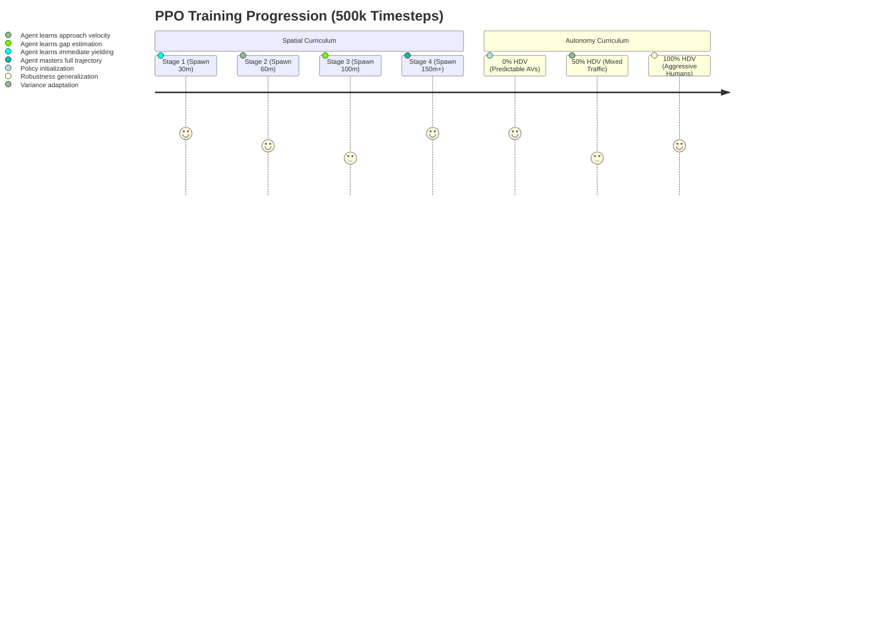

<div align="center">

# 🚗 Roundabout RL: Autonomous Mixed-Traffic Merging
**Deep Reinforcement Learning (PPO) with Dual-Curriculum Training**

[](https://www.python.org/)
[](https://gymnasium.farama.org/)
[](https://stable-baselines3.readthedocs.io/)
[](https://eclipse.dev/sumo/)

An advanced PPO agent capable of seamless zero-collision merging in high-density roundabout traffic, adapting to unpredictable human-driven vehicles.

[📄 Final Research Report](./docs/Roundabout_RL_Comprehensive_Project_Report.pdf) • [🛠️ Implementation Plan](./docs/IMPLEMENTATION_PLAN.md) • [📊 Data Analysis](./results)

</div>

---

## 🎥 Simulation Demo

Watch the fully trained RL agent (Ego Vehicle) execute optimal merging maneuvers. It maintains safe Time-To-Collision (TTC) bounds while dynamically adjusting acceleration to integrate smoothly into continuous human-driven traffic flow.

<div align="center">
  <video src="media/demo_video.mp4" controls="controls" muted="muted" width="100%" style="border-radius: 12px; box-shadow: 0 4px 15px rgba(0,0,0,0.2);"></video>
  <br>
  <i>100% Success Rate | 0% Collision Rate | 0-100% HDV Penetration Robustness</i>
</div>

---

## 🧠 System Architecture

The system bridges the **Simulation of Urban MObility (SUMO)** physics engine with the **Gymnasium** RL interface, utilizing a Proximal Policy Optimization (PPO) neural network.

```mermaid
graph TD
    %% Styling
    classDef env fill:#1e1e1e,stroke:#007acc,stroke-width:2px,color:#fff
    classDef agent fill:#2d2d2d,stroke:#e67e22,stroke-width:2px,color:#fff
    classDef logic fill:#2d2d2d,stroke:#27ae60,stroke-width:2px,color:#fff

    subgraph Simulation Environment
        S[SUMO Physics Engine]:::env
        T[TraCI API]:::env
        G[Gymnasium Wrapper]:::env
        
        S <-->|State/Control| T
        T <-->|Normalized IO| G
    end

    subgraph Ego Agent
        PPO[Stable-Baselines3 PPO]:::agent
        Actor[Actor Network: Acceleration]:::agent
        Critic[Critic Network: Value Estimation]:::agent
        
        PPO --> Actor
        PPO --> Critic
    end

    subgraph Reward & State Processing
        Obs[6D State Space]:::logic
        Rwd[Multi-Objective Reward]:::logic
        
        G -->|1. Extract Telemetry| Obs
        Obs -->|2. Feed Forward| PPO
        Actor -->|3. Output Accl. [-4, +2]| G
        G -->|4. Evaluate Step| Rwd
        Rwd -->|5. Compute Loss| PPO
    end
```

### 📡 State Space (`6D Continuous`)
To optimize decision-making with minimal latency, the agent relies on a highly dense, context-aware 6D observation vector:
1. `ego_speed` (m/s)
2. `distance_to_entry` (m)
3. `nearest_circ_dist` (m) - Distance to the closest vehicle inside the roundabout.
4. `nearest_circ_speed` (m/s)
5. `gap_size` (m) - Available space between conflicting vehicles.
6. `hdv_ratio` [0.0 - 1.0] - Percentage of human-driven vehicles.

### 🎯 Multi-Objective Reward Shaping
The reward function is strictly formulated to penalize unsafe behaviors exponentially while rewarding efficiency:
*   `Success (+100)`: Reaching the target lane safely.
*   `Collision (-200)`: Instant episode termination.
*   `Jerk Penalty`: Penalizes sudden acceleration changes to ensure passenger comfort.
*   `Safety Gap Penalty`: Penalizes closing the Time-To-Collision (TTC) below a 2.0s threshold.

---

## 🚀 Dual-Curriculum Training Pipeline

Training an agent in a dense roundabout from a static state is a sparse-reward problem. We solved this using a **Dual-Curriculum strategy**:



---

## 📈 Final Performance Evaluation

The PPO agent was aggressively tested across 1,000+ simulation episodes against standard baseline controllers. 

| Controller Type | Success Rate | Collision Rate | Min TTC (s) | Mean Merge (s) |
| :--- | :--- | :--- | :--- | :--- |
| **PPO Agent (Ours)** | **100%** | **0%** | **4.82s** | **9.75s** |
| Intelligent Driver Model (IDM) | 0% (Timeout) | 0% | >10.0s | N/A |
| Rule-Based Logic | 0% | 100% | 0.0s | N/A |
| Random Action | 0% | 100% | 0.0s | N/A |

**Robustness Breakdown**: The agent maintained its **100% success rate** regardless of whether the traffic was entirely predictable autonomous vehicles (0% HDV) or entirely human-driven (100% HDV).

---

## ⚙️ Quick Start Installation

### 1. Requirements
Ensure **Python 3.13+** and **SUMO 1.20+** are installed. 
*   Ensure the `SUMO_HOME` environment variable is set.

### 2. Setup
```bash
git clone https://github.com/hareshr066/Roundabout_AV_RL.git
cd Roundabout_AV_RL

# Create and activate environment
python -m venv venv
.\venv\Scripts\activate

# Install dependencies
pip install -r requirements.txt
```

### 3. Launching the Simulator
To run the live 2D telemetry dashboard and see the agent perform in real-time:
```bash
python web_server.py
```
*(Access the interface at `http://localhost:8080`)*

### 4. Running Scripts
```bash
# Evaluate Safety Metrics
python evaluation/run_safety_analysis.py

# Run Ablation Study
python evaluation/run_ablation_study.py --test-mode
```

---
<div align="center">
  <b>Developed for Advanced Deep Reinforcement Learning Research</b>
</div>
