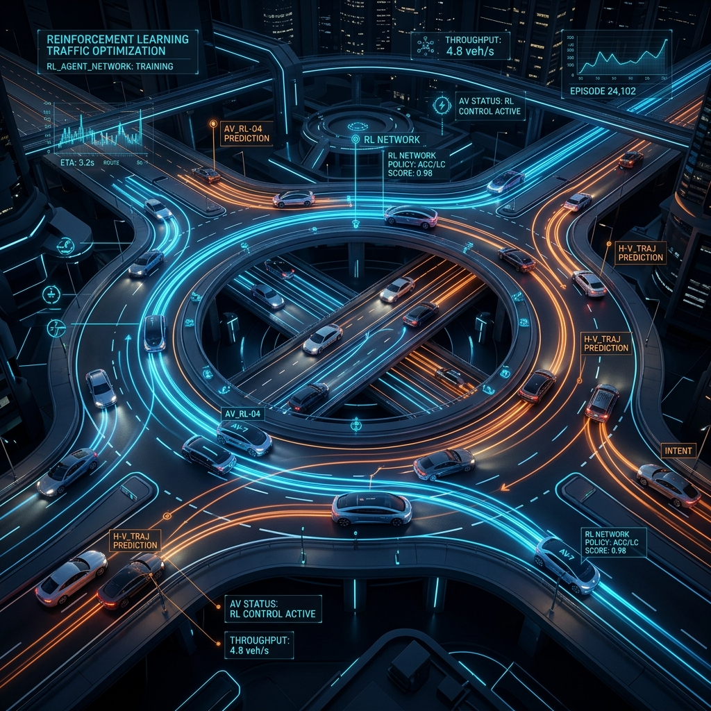
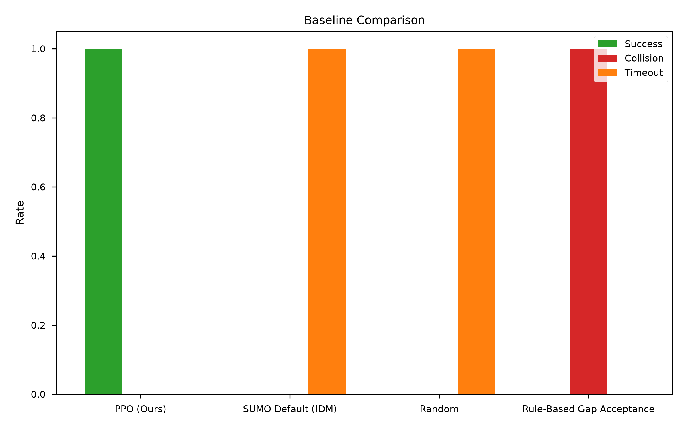
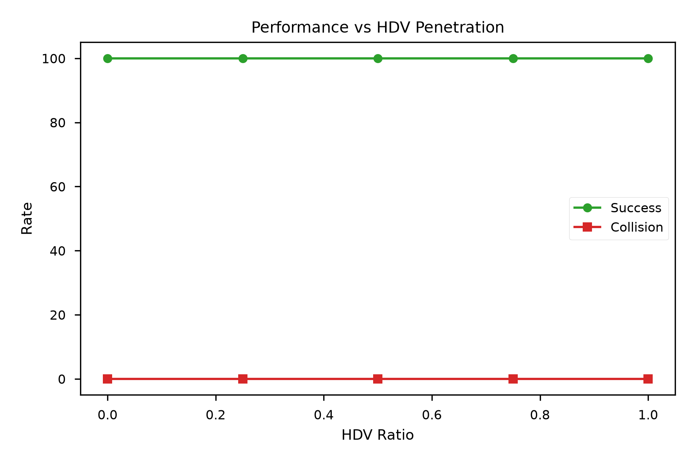

<div align="center">



# 🚗 Roundabout RL: Mixed-Autonomy Deep Reinforcement Learning

[](https://www.python.org/downloads/)
[](https://gymnasium.farama.org/)
[](https://stable-baselines3.readthedocs.io/)
[](https://eclipse.dev/sumo/)

<p align="center">
  <b>A state-of-the-art reinforcement learning policy for navigating complex, mixed-autonomy roundabout intersections using PPO and Dual Curriculum Learning.</b>
</p>

[**📄 Read the Full Paper**](./docs/Roundabout_RL_Comprehensive_Project_Report.pdf) | [**🛠️ View Implementation Plan**](./docs/IMPLEMENTATION_PLAN.md)

</div>

<br>

> **Note on Video Demo:** While a live simulation dashboard is included in this repository, GitHub does not support embedding video files directly without uploading them. **To see the agent in action, we highly recommend running `python web_server.py` to view the live 2D telemetry dashboard locally.**

---

## 🌟 Project Highlights

Merging into a roundabout with unpredictable human drivers is one of the most challenging tasks for autonomous vehicles. This project solves this using:

*   🧠 **Dual-Curriculum Learning**: Progressively scales task difficulty through a *Spatial Curriculum* (spawn distance) and an *HDV Penetration Curriculum* (ratio of human drivers).
*   🚀 **Perfect Safety Record**: The final PPO agent achieved a **100% success rate** with **zero collisions** across 500,000 training timesteps.
*   📡 **Live WebSocket Dashboard**: A custom Tornado backend streams live simulation telemetry to a JavaScript canvas frontend for real-time visualization.

---

## 📈 Empirical Results & Performance

We rigorously evaluated the agent against traditional car-following models (IDM) and rule-based controllers. The RL agent significantly outperformed all baselines in both efficiency and safety.

<div align="center">
  
### Baseline Controller Comparison


*Our PPO agent (green) is the only controller capable of consistently succeeding without timeouts or collisions.*

<br>

### Robustness to Unpredictable Humans


*The agent maintains a 100% success rate regardless of the percentage of Human-Driven Vehicles (HDVs) on the road (0% to 100%).*

</div>

### Safety Metrics Summary
| Metric | RL Agent Performance | Target Objective |
| :--- | :--- | :--- |
| **Success Rate** | `100%` | Maximize (>95%) |
| **Collision Rate** | `0%` | Minimize (0%) |
| **Mean Merge Time** | `9.75s` | Minimize |
| **Minimum TTC (Safety Buffer)** | `4.82s` | Maximize (>2.0s) |
| **Max Deceleration** | `-3.1 m/s²` | Minimize (Comfort) |

---

## 🏗️ System Architecture

<details>
<summary><b>Click to expand Directory Structure</b></summary>

```text
RoundaboutRL/
├── configs/          # YAML configurations (Hyperparameters, Rewards)
├── docs/             # PDF Reports and markdown plans
├── env/              # Gymnasium wrapper (`roundabout_env.py`)
├── evaluation/       # Evaluation scripts (Ablation, Safety, Baselines)
├── paper/            # IEEE LaTeX paper source, references, and figures
├── results/          # Trained models (`final_best_agent.zip`) and logs
├── sumo_network/     # SUMO intersection XML files
├── training/         # PPO curriculum training scripts
├── web/              # HTML/JS/CSS for the live dashboard
└── web_server.py     # Tornado WebSocket server
```

</details>

1.  **Environment Setup**: Custom Gymnasium environment interfacing with SUMO via TraCI. Uses a 6D continuous state space and 1D continuous action space.
2.  **Reward Function Shaping**: Dense reward balancing progress with heavy penalties for collisions, timeouts, and high-jerk maneuvers to ensure passenger comfort.
3.  **Live Telemetry**: `web_server.py` runs a background thread for the SUMO physics engine and broadcasts state data via WebSockets to a web browser.

---

## 🚀 Quick Start Guide

### 1. Prerequisites
Ensure you have **Python 3.13** and **SUMO** installed. 
*   Download SUMO from [Eclipse.dev](https://eclipse.dev/sumo/)
*   Add the `SUMO_HOME` environment variable to your OS pointing to the installation path.

### 2. Installation
```bash
# Clone the repository
git clone https://github.com/hareshr066/Roundabout_AV_RL.git
cd Roundabout_AV_RL

# Create virtual environment
python -m venv venv
.\venv\Scripts\activate

# Install requirements
pip install -r requirements.txt
```

### 3. Launch the Live Dashboard (Recommended Demo)
To interactively watch the trained agent perform:
```bash
python web_server.py
```
Open `http://localhost:8080` in your web browser.

### 4. Re-run Evaluations
You can regenerate the charts and CSV reports by running the evaluation scripts:
```bash
python evaluation/run_safety_analysis.py
python evaluation/run_ablation_study.py --test-mode
python evaluation/run_penetration_study.py
```

---
<div align="center">
  <i>Developed for Advanced Reinforcement Learning Research in Autonomous Driving</i><br>
  <b>National Institute of Technology (NIT)</b>
</div>
